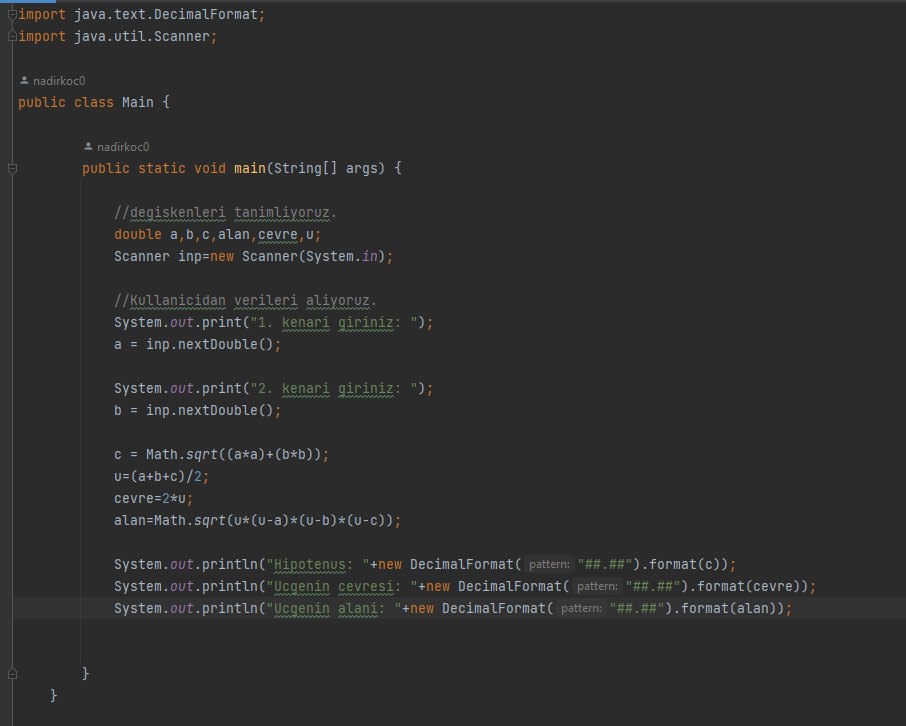
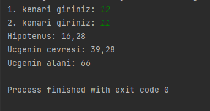

# Dik Üçgenin Hipotenüsünü Hesaplayan Program
Bu program üçgenin hipotenüs dışında 2 kenarının uzunluğunu kullanıcıdan isteyerek hipotenüsü hesaplar.
Bu programı JAVA 101 eğitimi ile yaptım.

## Programın Kodunun Fotoğrafı

## Programın Fotoğrafı

